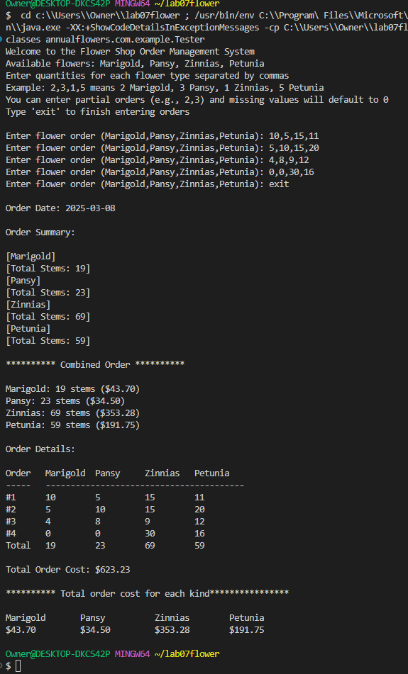

## Flower Shop Application

This application allows users to order flowers by selecting from a list of available flowers and specifying the quantity. The application processes the input and displays the order details.

## File and Directory Structure

```
flowershop/
├── src/
│   └── main/
│       └── java/
│           └── annualflowers/
│               └── com/
│                   └── example/
│                       ├── AnnualFlowers.java
│                       ├── OrderFlowers.java
│                       ├── Tester.java
│                       └── StringUtility.java
├── readme.md
└── Screenshot.png
```

## Classes

### [AnnualFlowers](src/main/java/annualflowers/com/example/AnnualFlowers.java)
This class manages the details of the annual flowers, including their names and prices. It provides methods to set and get flower details and calculate prices.

### [OrderFlowers](src/main/java/annualflowers/com/example/OrderFlowers.java)
This class handles the processing of the flower order. It includes methods to split the input and manage the order details.

### [Tester](src/main/java/annualflowers/com/example/Tester.java)
This class contains the main method which serves as the entry point of the application. It interacts with the user to get the flower order details and uses the `OrderFlowers` class to process the order.

### [StringUtility](src/main/java/annualflowers/com/example/StringUtility.java)
This class provides utility methods for string manipulation, such as trimming and splitting strings.

## Result


